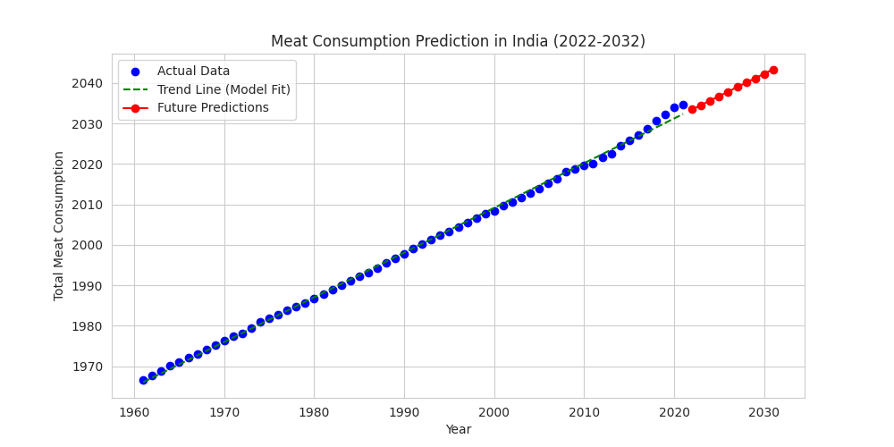

# Meat-Consumption-Prediction-Using-Python

*This project was created during my **4th semester of 2nd year** for the subject **Foundations of Data Warehousing and Data Mining**. It focuses on predicting **India’s future meat consumption** using **Linear Regression**.*

## 📋 About the Project:  
This project analyzes **historical meat consumption data (1961-2021)** and forecasts future trends (2022-2032).  
- **Machine Learning Model Used**: Linear Regression  
- **Dataset Source**: Kaggle  
- **Tools Used**: Python, Pandas, NumPy, Matplotlib, Scikit-Learn  

## 🧱 Project Structure  
- [`Report`](./report.pdf) 📄 – Contains the **final project report**  
- [`Code`](./model.py) 🐍 – Python scripts for data preprocessing, model training, and prediction  
- [`Dataset`](./meat_consumption.csv) 📊 – The dataset used for training the model  
- [`Images`](./Images) 📈 – Graphs and charts showing results  
 
## 🏁 Getting-Started:

### **1. Clone the Repository** 
```sh
git clone https://github.com/AyushWarrier/Meat-Consumption-Prediction-Using-Python.git
cd Meat-Consumption-Prediction-Using-Python(https://github.com/AyushWarrier/Meat-Consumption-Prediction-Using-Python.git)
```

### **2. Install Dependencies**
Make sure you have Python 3.x installed, then run:
```sh
pip install pandas numpy matplotlib scikit-learn
```

### **3. Run the Code**
```sh
python model.py
```
This will train the model and generate **future predictions**.

## 📊 Results:
The model achieved:
- R² Score: 0.9985
- MAE: 0.55
- RMSE: 0.75
 
## 📈 Example Prediction Plot:
  

## 🤝 Contributing:
If you find this a helpful project or want to improve, please fork the repo and submit a pull request.

## 📜 License:
This project is *open-source* and free to use.
